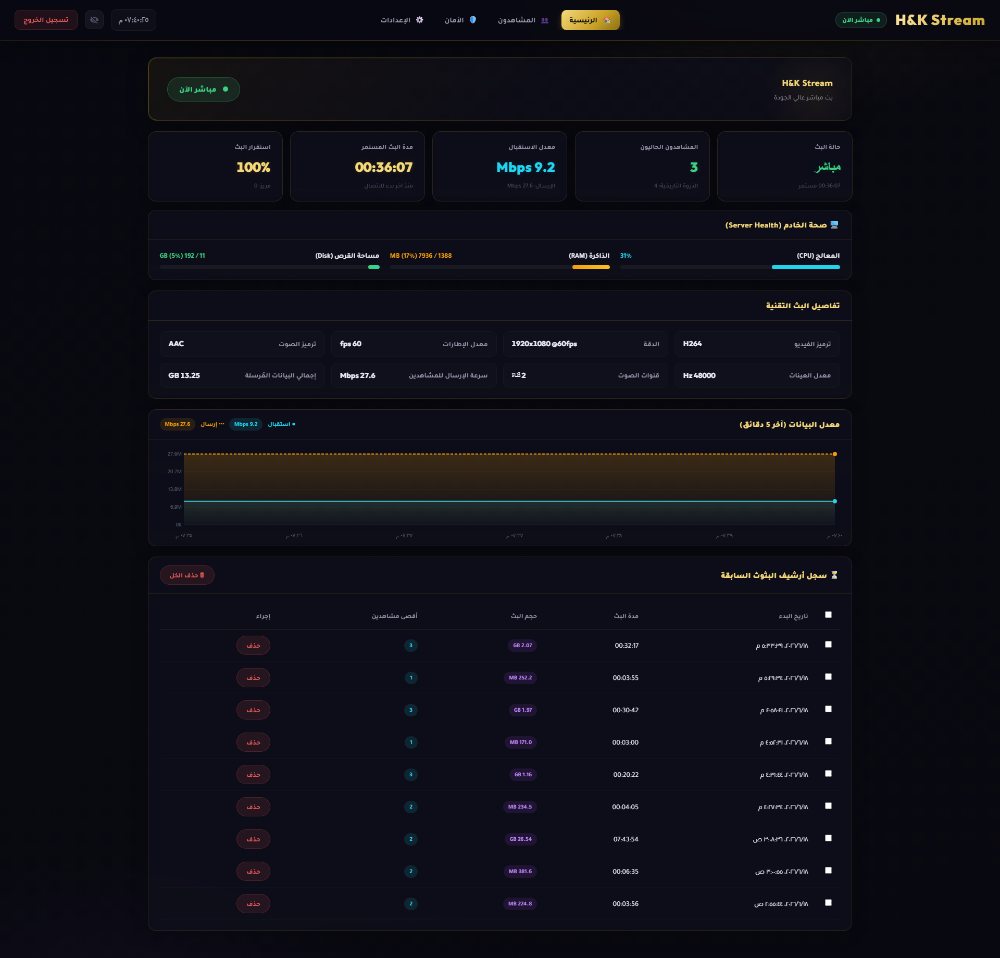
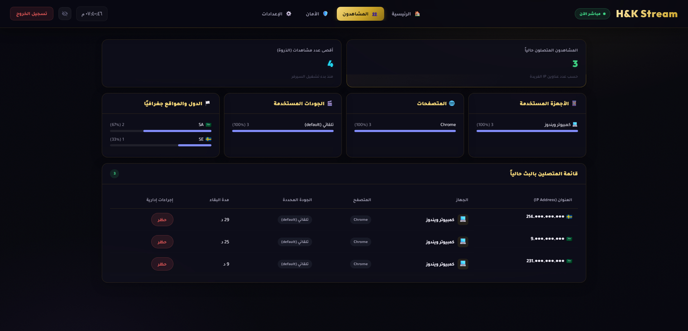
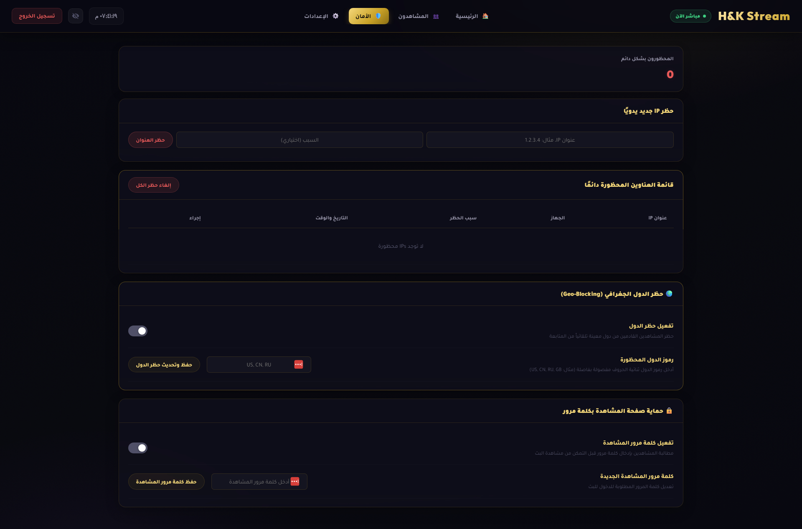
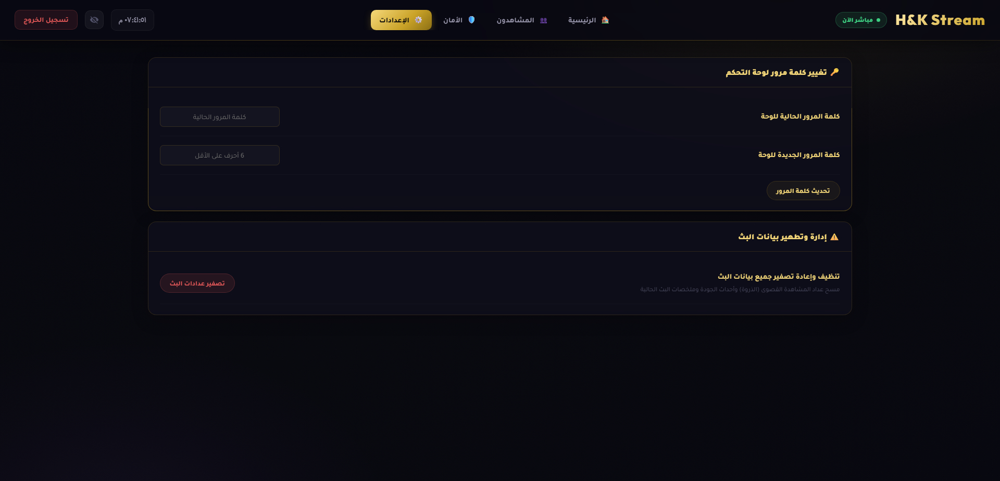
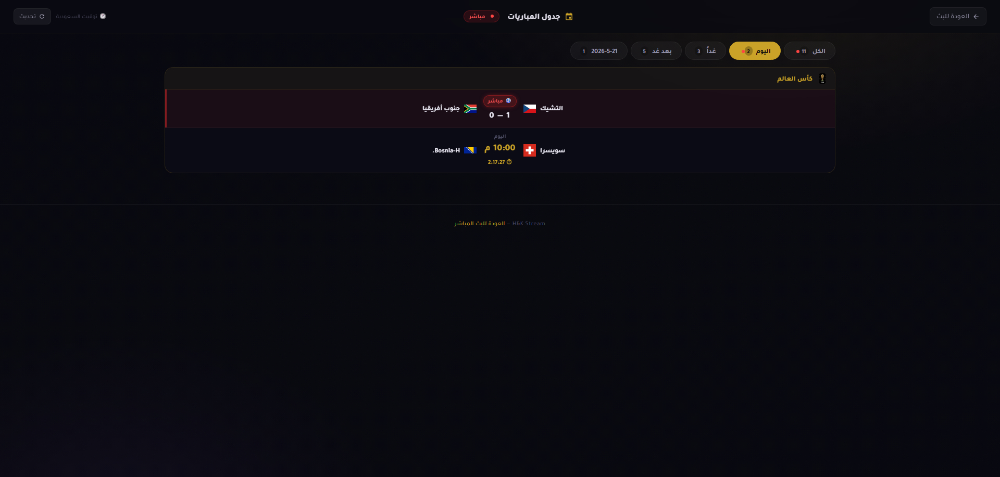
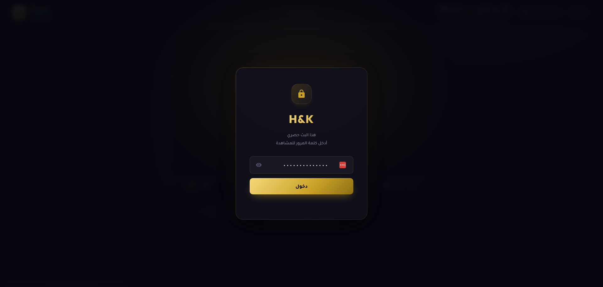

<div align="center">

# 🎥 HK-Stream-ome

**منصّة بثّ مباشر عربية متكاملة — منخفضة التأخير، آمنة، وسهلة النشر**

بثّ من OBS ويشاهد جمهورك فوراً عبر المتصفّح بلا تطبيقات — مبنية على
**[OvenMediaEngine](https://www.ovenmediaengine.com/)** (WebRTC / LL-HLS) خلف **nginx**،
مع خادم تتبّع وإدارة بـ **Python** ولوحة تحكّم وواجهة مشاهدة عربية كاملة.


</div>

---

## 📸 لقطات

<div align="center">

| الرئيسية | المشاهدون |
|:---:|:---:|
|  |  |
| **الأمان** | **الإعدادات** |
|  |  |
| **جدول المباريات** | **حماية المشاهدة** |
|  |  |

</div>

---

## ✨ المميزات

- **بثّ منخفض التأخير** — WebRTC (أقل من ثانية) مع تراجع تلقائي إلى LL-HLS.
- **تمرير بلا ترميز (Bypass)** — يمرّر جودة المصدر كما هي → استهلاك معالج شبه معدوم.
- **لوحة تحكّم عربية** — حالة البث، المشاهدون الأحياء، الإحصاءات، صحة الخادم، وإجماليات التشغيل.
- **حماية متعددة الطبقات** — كلمة مرور للمشاهدة، حظر/طرد IP (iptables)، وحظر جغرافي للدول.
- **مواعيد المباريات** — تكامل مع [football-data.org](https://www.football-data.org/) لعرض جدول المباريات.
- **خصوصية مدمجة** — مسح تلقائي لعناوين IP للمشاهدين وسجلّات nginx عند توقّف البث.

---

## ⚡ التثبيت بأمر واحد (خادم جديد)

على خادم **Ubuntu** جديد بنطاق مُوجَّه إليه — أمر واحد يثبّت ويشغّل كل شيء
(OvenMediaEngine + خادم التتبّع + nginx + شهادة TLS + الجدار الناري):

```bash
git clone https://github.com/abooodHub/HK-Stream-ome.git
cd HK-Stream-ome
sudo DOMAIN=example.com EMAIL=you@mail.com FOOTBALL_API_KEY=xxxx bash install.sh
```

| المتغيّر | إلزامي؟ | الوصف |
|---|:---:|---|
| `DOMAIN` | ✅ | النطاق المُوجَّه للخادم |
| `EMAIL` | ✅ | بريد لإصدار شهادة Let's Encrypt |
| `FOOTBALL_API_KEY` | ❌ | مفتاح المباريات (يُترك فارغاً لتعطيلها) |
| `OME_API_TOKEN` | ❌ | يُولَّد عشوائياً إن تُرك فارغاً |
| `PUBLIC_IP` | ❌ | يُكتشف تلقائياً |

يطبع السكربت في النهاية رابط الموقع، توكن OME، وكيفية استخراج كلمة مرور لوحة التحكّم.

---

## 🐳 التشغيل عبر Docker (محلي/تطوير)

يشغّل خدمتين: حاوية `tracker` (Python) وحاوية `web` (nginx تخدم `web/` وتعكس `/tracker-api/`):

```bash
cp .env.example .env        # (اختياري) املأ FOOTBALL_API_KEY و OME_API_TOKEN
docker compose up --build -d

# الواجهة:       http://localhost:8080
# لوحة التحكّم:   http://localhost:8080/dashboard.html
docker compose logs -f tracker     # كلمة مرور admin تُطبع هنا أول مرة
docker compose down                # إيقاف (البيانات تبقى في volume: tracker-data)
```

> **حدود التشغيل بالحاوية:** ميزات مستوى-المضيف (حظر **iptables**، قراءة **سجلّ nginx**)
> تتدهور بأمان دون صلاحيات إضافية. و**OvenMediaEngine** + **TLS** يُداران خارج هذا الـ compose
> (للنشر الكامل استخدم `install.sh`).

---

## 🔄 كيف يعمل

```
   OBS ──RTMP:1935──▶  OvenMediaEngine  ──webhook──▶  Python Tracker :9999
                         (Docker)         (قبول البثّ)    (مشاهدون/أمان/إحصاءات)
                            │                                  ▲
                     WebRTC / LL-HLS                           │ /tracker-api
                            ▼                                  │
   المتصفّح ◀──HTTPS:443──  nginx (reverse proxy + TLS) ───────┘
                          يخدم /web ويوجّه /ome-hls /ome-ws /tracker-api
```

1. **البثّ**: يدفع OBS عبر RTMP إلى OvenMediaEngine (المنفذ 1935).
2. **القبول**: قبل السماح بالبثّ، يستدعي OME خطّاف القبول (`/api/ome/webhook`) في خادم التتبّع للتحقق من مفتاح البثّ.
3. **التوزيع**: يحوّل OME البثّ إلى WebRTC و LL-HLS، ويعكسهما nginx للمشاهدين عبر HTTPS.
4. **المشاهدة**: تجرّب الواجهة WebRTC أولاً (تأخير أدنى)، ثم LL-HLS عند الحاجة.
5. **التتبّع**: يسجّل خادم Python المشاهدين والجلسات والإحصاءات، ويطبّق الحظر/الطرد والحماية.

---

## 🎛️ لوحة التحكّم

متاحة على `/dashboard.html` وتتطلّب تسجيل دخول (كلمة مرور admin تُطبع في سجلّ الخدمة أول مرة):

- **الرئيسية** — حالة البث، المشاهدون والذروة، معدّل البيانات، مدّة البث، استقرار البث.
- **صحة الخادم** — المعالج/الذاكرة/القرص بأشرطة ملوّنة تحذيرية.
- **إجماليات الخادم** — فترة تشغيل الخادم، ساعات البث الكلّية، وحجم البيانات الكلّي (تراكمي).
- **المشاهدون** — قائمة حيّة (جهاز/متصفّح/جودة/دولة) مع إخفاء IP، وتفصيل الأجهزة والدول.
- **الأمان** — كلمة مرور المشاهدة، حظر IP يدوي، القائمة المحظورة، والحظر الجغرافي.
- **الإعدادات** — تغيير كلمة مرور اللوحة، وتصفير عدادات/بيانات البث.

---

## 📂 محتوى المستودع

| المسار | الوصف |
|---|---|
| `install.sh` | تثبيت كامل بأمر واحد على خادم Ubuntu جديد |
| `tracker/tracker_rtmp.py` | نقطة دخول خادم التتبّع (المنفذ `9999`) |
| `tracker/ome_tracker/` | حزمة الخادم: `config`/`store`/`auth`/`geoip`/`detect`/`matches`/`metrics`/`ome`/`handler` |
| `web/` | الواجهة: المشاهدة، لوحة التحكّم، المباريات، المساعدة |
| `config/your-domain.com.conf` | قالب إعداد nginx (reverse proxy + TLS + حماية HLS) |
| `config/ome/Server.xml` | قالب إعداد OvenMediaEngine (يملؤه `install.sh`) |
| `deploy/ome-tracker.service` | وحدة systemd لتشغيل التتبّع |
| `Dockerfile` · `docker-compose.yml` | تشغيل حاوي للـ tracker + web |
| `.env.example` | قالب متغيّرات البيئة (انسخه إلى `.env`) |

---

## ⚙️ متغيّرات البيئة

| المتغيّر | الوصف |
|---|---|
| `FOOTBALL_API_KEY` | مفتاح [football-data.org](https://www.football-data.org/) لعرض المباريات |
| `OME_API_TOKEN` | توكن OME API — يطابق `<AccessToken>` في `Server.xml` |
| `ALLOWED_ORIGIN` | النطاق المسموح به في CORS (مثل `https://your-domain.com`) |
| `TRACKER_HOST` | مضيف ربط خادم التتبّع (افتراضي `127.0.0.1`؛ في Docker `0.0.0.0`) |
| `TRACKER_PORT` | منفذ خادم التتبّع (افتراضي `9999`) |

---

## 🛠️ النشر اليدوي

للتحكّم خطوة بخطوة بدل `install.sh` — راجع الدليل التفصيلي في
[`docs`](#) أو اتبع منطق `install.sh`. باختصار: ثبّت الحزم → شغّل OME (Docker) →
انشر خادم التتبّع (systemd) → انشر الواجهة + nginx → أصدر شهادة TLS (certbot) → اضبط الجدار الناري.

> ⚠️ **مهم:** مدى UDP في الجدار الناري لازم يطابق مدى ICE في OME (`10000-10099`)،
> وإلا يعمل WebRTC على الجوال ويفشل على سطح المكتب.

---

## 🔐 الأمان

ميزات الحماية المدمجة في المنصّة:

- **لا أسرار في الكود** — كل المفاتيح تُقرأ من متغيّرات البيئة (`EnvironmentFile` بصلاحية `600`).
- **منافذ داخلية محجوبة** — `8080` (HLS) و`8081` (OME API) لا يُوصَل إليهما إلا عبر nginx.
- **مصادقة وحماية** — تجزئة كلمات المرور (bcrypt/sha256)، توكنات للوصول، حدّ لمحاولات الدخول، وحظر/طرد IP عبر iptables.
- **خصوصية المشاهدين** — مسح تلقائي لعناوين IP وسجلّات nginx عند توقّف البث.
- **بيانات حسّاسة مستثناة** — ملفات `data/` (هاشات/IP/جلسات) و`.env` خارج Git عبر `.gitignore`.

> 💡 للنشر الإنتاجي يُنصح إضافةً بتفعيل **fail2ban** واستخدام **مفاتيح SSH** بدل كلمات المرور.

---

## 🙏 شكر وتقدير

هذا المشروع يقوم على أدوات مفتوحة المصدر رائعة — كل الشكر لفِرقها:

- **[OvenMediaEngine](https://github.com/AirenSoft/OvenMediaEngine)** — محرّك البثّ منخفض التأخير (WebRTC / LL-HLS)، قلب المنصّة النابض. 🙌
- **[OvenPlayer](https://github.com/AirenSoft/OvenPlayer)** — مشغّل الويب لعرض البثّ في المتصفّح.
- **[nginx](https://nginx.org/)** — الوكيل العكسي وإنهاء TLS.
- **[football-data.org](https://www.football-data.org/)** — بيانات مواعيد المباريات.
- **[Let's Encrypt](https://letsencrypt.org/)** — شهادات TLS المجانية.
- **[Docker](https://www.docker.com/)** — حاويات التشغيل.

---

<div align="center">

**التقنيات:** [OvenMediaEngine](https://www.ovenmediaengine.com/) · [nginx](https://nginx.org/) · Python 3 · Docker · HTML/CSS/JS عربي (RTL)

صُنع بـ ❤️ للبثّ العربي

</div>
